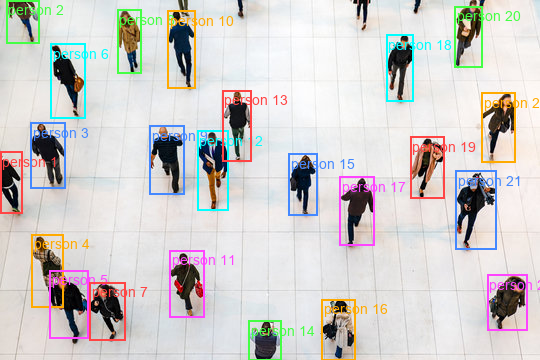

# locate-anything-4bit

> Running NVIDIA's [LocateAnything-3B](https://huggingface.co/nvidia/LocateAnything-3B) vision-language model on a **GTX 1650 (4 GB VRAM)** using 4-bit NF4 quantization via `bitsandbytes`.


*26 people detected in a restaurant surveillance frame — running on just 2.91 GB VRAM*

---

## What is LocateAnything?

**LocateAnything** is a state-of-the-art vision-language model (VLM) released by NVIDIA Research in May 2026. Unlike traditional object detectors, it accepts **plain English queries** to locate objects — no class ID lists, no retraining required.

Supported tasks:
- Object detection (`"Locate all persons"`)
- Referring expression grounding (`"the person in the red shirt"`)
- GUI element grounding
- Scene text / OCR localization
- Point-based localization

What makes it special is **Parallel Box Decoding (PBD)** — it predicts full bounding boxes atomically in a single forward pass, making it significantly faster than traditional token-by-token coordinate decoding.

- **Paper:** [arXiv:2605.27365](https://arxiv.org/abs/2605.27365)
- **Official Repo:** [NVlabs/Eagle](https://github.com/NVlabs/Eagle)
- **HuggingFace Model:** [nvidia/LocateAnything-3B](https://huggingface.co/nvidia/LocateAnything-3B)

---

## What This Repo Adds

The official model is designed for high-end GPUs (H100, A100). This repo makes it accessible on **consumer-grade 4 GB VRAM GPUs** using 4-bit quantization:

| Script | Description |
|---|---|
| `run_4bit.py` | Minimal 4-bit inference on a single image — prints raw model output and VRAM stats |
| `visualize_4bit.py` | Full pipeline: runs inference + draws bounding boxes → saves `result_4bit.png` |
| `visualize_detection.py` | Uses the `LocateAnythingWorker` class with 4-bit config for cleaner integration |
| `detect_person.py` | Simple full-precision detection script (requires high-VRAM GPU, included for reference) |
| `locateanything_worker.py` | NVIDIA's original stateful worker class for inference |

**Tested on GTX 1650 (4.29 GB VRAM):**

| Metric | Value |
|---|---|
| Quantization | 4-bit NF4 (via bitsandbytes) |
| VRAM after model load | **2.91 GB** |
| VRAM peak during inference | **3.00 GB** |
| Inference time (per frame) | ~28 seconds |
| Test scene | Restaurant surveillance (cluttered, multiple overlapping subjects) |
| Detections | 26 persons correctly boxed |

---

## Requirements

- Python 3.11
- NVIDIA GPU with CUDA support (minimum ~3.5 GB VRAM for 4-bit)
- Windows or Linux
- CUDA 12.x

---

## Setup

### 1. Clone this repo

```bash
git clone https://github.com/anuj1611/locate-anything-4bit.git
cd locate-anything-4bit
```

### 2. Create and activate a virtual environment

**Windows (cmd):**
```cmd
py -3.11 -m venv venv
venv\Scripts\activate
```

**Linux / macOS:**
```bash
python3.11 -m venv venv
source venv/bin/activate
```

### 3. Install PyTorch with CUDA 12.8

```bash
pip install torch torchvision torchaudio --index-url https://download.pytorch.org/whl/cu128
```

> For a different CUDA version, visit [https://pytorch.org/get-started/locally/](https://pytorch.org/get-started/locally/)

### 4. Install dependencies

```bash
pip install transformers==4.57.1 tokenizers==0.22.0 sentencepiece==0.2.0
pip install accelerate==1.5.2 peft==0.12.0 bitsandbytes
pip install pillow huggingface_hub safetensors
pip install timm einops einops-exts lmdb decord av
pip install opencv-python scikit-image imagehash scipy
```

> **Note:** `deepspeed` and `liger_kernel` are **not required** for inference — skip them on Windows.

### 5. Download the model

The model (~7.6 GB) is downloaded automatically from HuggingFace on first run. To pre-download manually:

```bash
huggingface-cli download nvidia/LocateAnything-3B
```

---

## Usage

### Run 4-bit inference (recommended for low-VRAM GPUs)

Place your image as `test.png` in the project folder, then:

```bash
# Windows cmd (always use venv\Scripts\python.exe, not just python)
venv\Scripts\python.exe visualize_4bit.py

# Windows PowerShell
$env:PYTHONIOENCODING="utf-8"; .\venv\Scripts\python.exe visualize_4bit.py

# Linux
python visualize_4bit.py
```

This will:
1. Load the model in 4-bit NF4 quantization (~2.91 GB VRAM)
2. Resize your image to fit in VRAM (shorter side capped at 448 px by default)
3. Run detection
4. Save the annotated result as `result_4bit.png`

### Change the detection query

Edit `QUESTION` in `visualize_4bit.py`:

```python
# Detect multiple categories
QUESTION = "Locate all the instances that matches the following description: person</c>car</c>bicycle."

# Phrase grounding
QUESTION = "Locate all the instances that match the following description: people wearing red shirts."

# Text / OCR detection
QUESTION = "Detect all the text in box format."

# GUI grounding
QUESTION = "Point to: the search button."
```

### Adjust image resolution

Edit `MAX_SIDE` in `visualize_4bit.py` (default: `448`):

```python
MAX_SIDE = 448   # safest for 4 GB VRAM
MAX_SIDE = 672   # better accuracy, needs ~1 GB more VRAM headroom
MAX_SIDE = 896   # maximum recommended for 4 GB VRAM with 4-bit weights
```

---

## Output Format

The raw model output uses special tokens:

```
<ref>person</ref><box><x1><y1><x2><y2></box>
```

Coordinates are integers in `[0, 1000]`. To convert to pixel coordinates:
```python
pixel_x1 = (x1 / 1000) * image_width
pixel_y1 = (y1 / 1000) * image_height
```

---

## Important Notes for Windows Users

- **Always use `venv\Scripts\python.exe script.py`** in cmd — typing just `python` may resolve to the system Python which won't have your packages.
- In PowerShell, set `$env:PYTHONIOENCODING="utf-8"` before running to avoid Unicode print errors from transformers warnings.
- The startup warning `Using a slow image processor as use_fast is unset...` is **harmless** — ignore it.

### Real-time video

This model is **not suitable for real-time video** on consumer hardware — inference takes ~28 seconds per frame on a GTX 1650. For real-time detection, use YOLOv8/v10. LocateAnything is ideal for high-accuracy, language-driven grounding on individual frames.

---

## Credits

- Model and paper by [NVIDIA Research](https://research.nvidia.com/labs/lpr/locate-anything/)
- Official codebase: [NVlabs/Eagle](https://github.com/NVlabs/Eagle)
- 4-bit quantization scripts by [@anuj1611](https://github.com/anuj1611)
