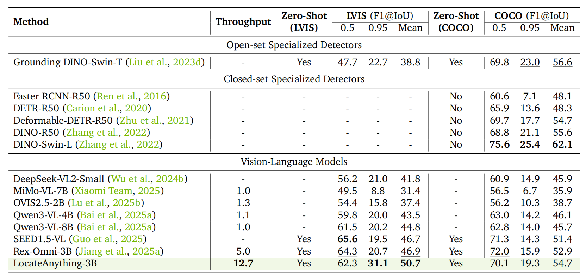
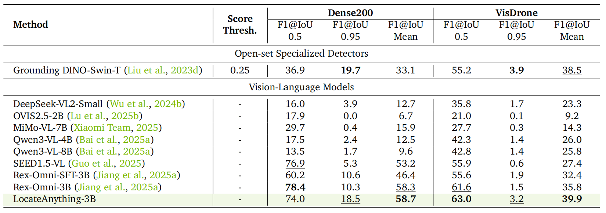
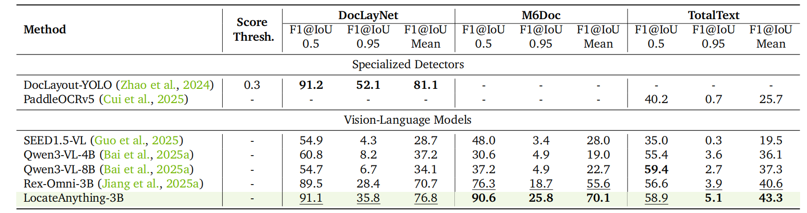
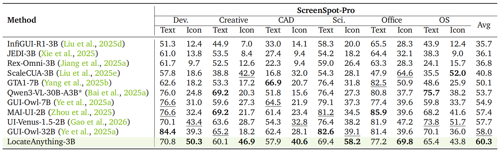
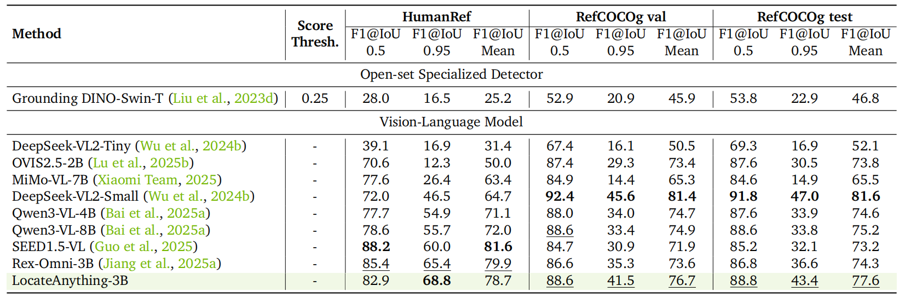
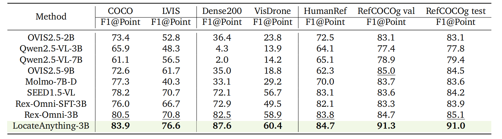
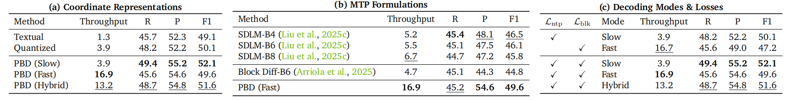
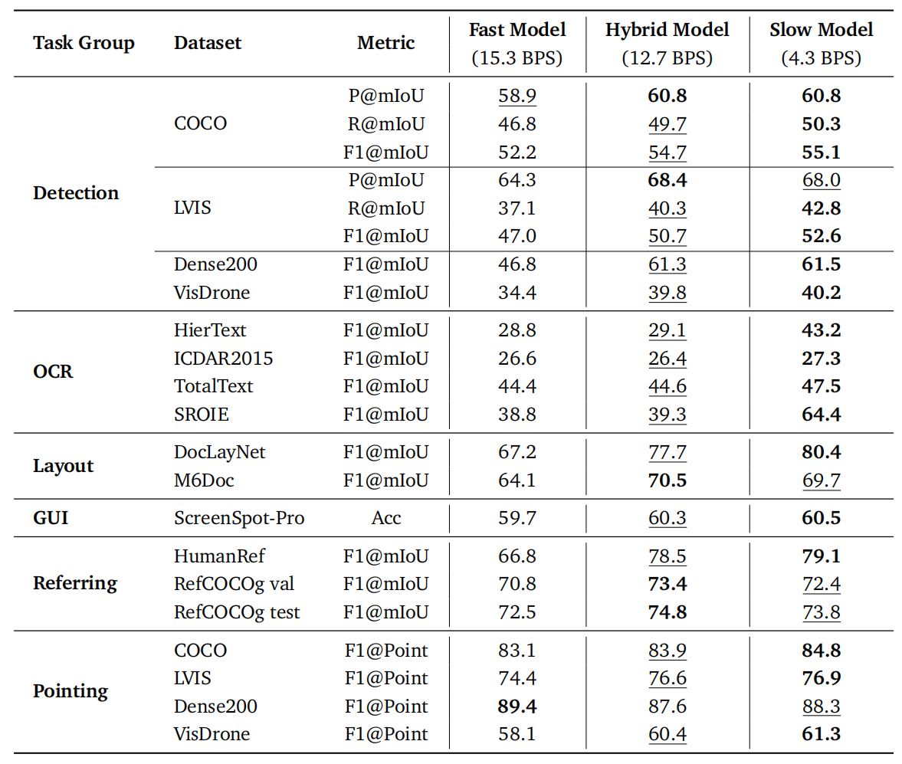
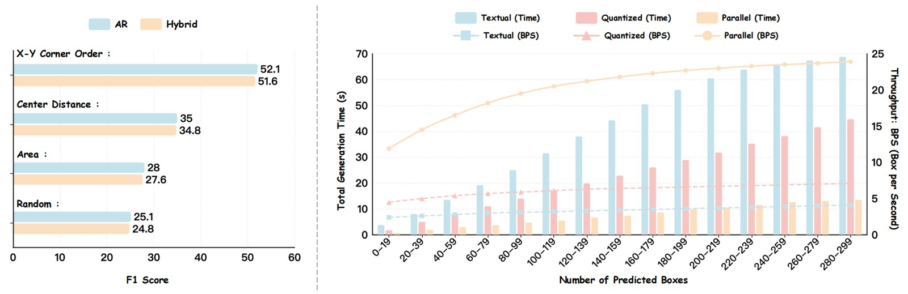
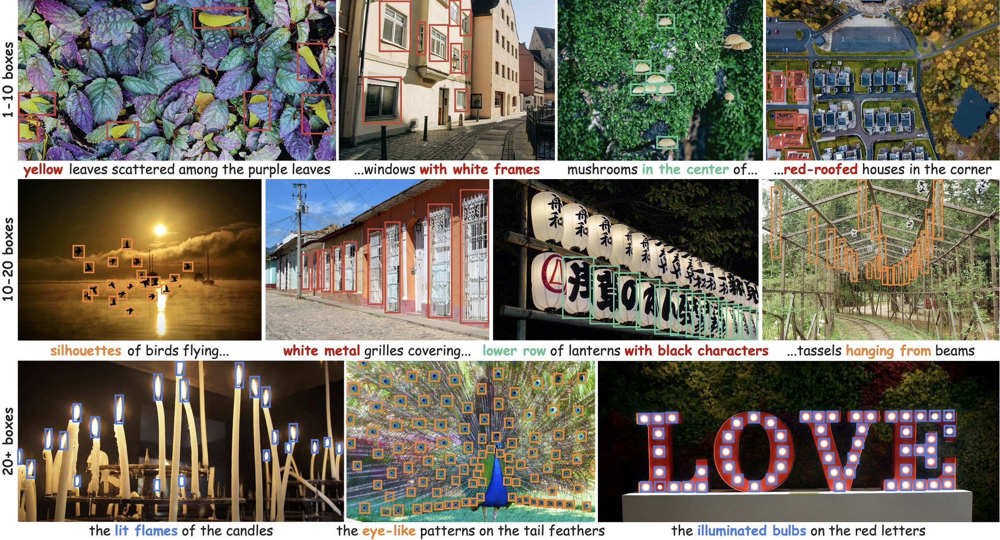

# LocateAnything — Detailed Results

> Full benchmark tables, ablation studies, and qualitative visualizations.
> For a high-level overview, see the project [README](../README.md).

---

## Table of Contents

- [Headline Numbers](#headline-numbers)
- [1. Common Object Detection — LVIS & COCO](#1-common-object-detection--lvis--coco)
- [2. Dense Object Detection — Dense200 & VisDrone](#2-dense-object-detection--dense200--visdrone)
- [3. Document Layout & OCR](#3-document-layout--ocr)
- [4. GUI Grounding — ScreenSpot-Pro](#4-gui-grounding--screenspot-pro)
- [5. Referring Expression Comprehension](#5-referring-expression-comprehension)
- [6. Pointing](#6-pointing)
- [7. Ablation Study](#7-ablation-study)
- [8. Qualitative Results](#8-qualitative-results)

---

## Headline Numbers

| | LocateAnything-3B |
|:--|:--:|
| Throughput on a single H100 | **12.7 BPS** |
| Speedup vs. Qwen3-VL (1.1 BPS) | **≈10×** |
| Speedup vs. Rex-Omni (5.0 BPS) | **≈2.5×** |
| LVIS F1@Mean | **50.7** *(+3.8 over Rex-Omni)* |
| COCO F1@Mean | **54.7** *(+1.8 over Rex-Omni)* |
| Dense200 F1@Mean | **58.7** |
| DocLayNet F1@Mean | **76.8** |
| M6Doc F1@Mean | **70.1** *(+14.5 over Rex-Omni)* |
| TotalText F1@Mean | **43.3** |
| ScreenSpot-Pro Avg | **60.3** *(SOTA)* |
| HumanRef F1@0.95 | **68.8** *(SOTA)* |
| RefCOCOg val F1@Mean | **76.7** *(SOTA)* |
| Pointing — best on all 7 benchmarks | ✅ |

---

## 1. Common Object Detection — LVIS & COCO

<p align="center"></p>

| Method | BPS | LVIS F1@0.5 | LVIS F1@0.95 | LVIS F1@Mean | COCO F1@0.5 | COCO F1@0.95 | COCO F1@Mean |
|--------|:---:|:-----------:|:------------:|:------------:|:-----------:|:------------:|:------------:|
| Grounding DINO-Swin-T | — | 47.7 | 22.7 | 38.8 | 69.8 | 23.0 | 56.6 |
| DeepSeek-VL2-Small    | — | 56.2 | 21.0 | 41.8 | 60.9 | 14.9 | 45.9 |
| Qwen3-VL-4B           | 1.1 | 59.8 | 20.0 | 43.5 | 63.0 | 14.2 | 46.1 |
| Qwen3-VL-8B           | 1.0 | 61.5 | 20.2 | 44.8 | 62.8 | 14.0 | 45.7 |
| SEED1.5-VL            | — | **65.6** | 19.5 | 46.7 | 71.3 | 14.3 | 51.4 |
| Rex-Omni-3B           | 5.0 | 64.3 | 20.7 | 46.9 | **72.0** | 15.9 | 52.9 |
| **LocateAnything-3B** | **12.7** | 62.3 | **31.1** | **50.7** | 70.1 | **19.3** | **54.7** |

> LocateAnything improves the mean F1 by **+3.8%** on LVIS and **+1.8%** on COCO over Rex-Omni at identical model size, with particularly strong gains at high IoU thresholds (**31.1 vs. 20.7** at IoU=0.95 on LVIS).

---

## 2. Dense Object Detection — Dense200 & VisDrone

<p align="center"></p>

| Method | Dense200 F1@0.5 | Dense200 F1@0.95 | Dense200 F1@Mean | VisDrone F1@0.5 | VisDrone F1@0.95 | VisDrone F1@Mean |
|--------|:---------------:|:----------------:|:----------------:|:---------------:|:----------------:|:----------------:|
| Grounding DINO-Swin-T | 36.9 | **19.7** | 33.1 | 55.2 | **3.9** | 38.5 |
| Qwen3-VL-4B           | 17.5 | 2.4 | 12.5 | 42.3 | 1.4 | 26.0 |
| SEED1.5-VL            | 76.9 | 5.3 | 53.2 | 55.9 | 0.6 | 27.4 |
| Rex-Omni-3B           | **78.4** | 10.3 | 58.3 | 61.6 | 1.5 | 35.8 |
| **LocateAnything-3B** | 74.0 | 18.5 | **58.7** | **63.0** | 3.2 | **39.9** |

> LocateAnything achieves **58.7** and **39.9** mean F1 on Dense200 and VisDrone respectively, substantially outperforming Rex-Omni (58.3 / 35.8), demonstrating superior boundary delineation in heavily overlapping scenes.

---

## 3. Document Layout & OCR

<p align="center"></p>

| Method | DocLayNet F1@0.5 | DocLayNet F1@0.95 | DocLayNet F1@Mean | M6Doc F1@0.5 | M6Doc F1@0.95 | M6Doc F1@Mean | TotalText F1@0.5 | TotalText F1@0.95 | TotalText F1@Mean |
|--------|:----------------:|:-----------------:|:-----------------:|:------------:|:-------------:|:-------------:|:----------------:|:-----------------:|:-----------------:|
| DocLayout-YOLO | **91.2** | **52.1** | **81.1** | — | — | — | — | — | — |
| Qwen3-VL-4B    | 60.8 | 8.2  | 37.2 | 30.6 | 4.9 | 19.0 | 55.4 | 3.6 | 36.1 |
| Qwen3-VL-8B    | 54.7 | 6.7  | 34.1 | 37.2 | 4.9 | 22.7 | **59.4** | 2.7 | 37.3 |
| Rex-Omni-3B    | 89.5 | 28.4 | 70.7 | 76.3 | 18.7 | 55.6 | 56.6 | 3.9 | 40.6 |
| **LocateAnything-3B** | 91.1 | 35.8 | 76.8 | **90.6** | **25.8** | **70.1** | 58.9 | **5.1** | **43.3** |

> New standards on document understanding: **76.8** and **70.1** mean F1 on DocLayNet and M6Doc respectively, outperforming Rex-Omni by substantial margins (**+6.1 / +14.5**). On TotalText OCR, **43.3** mean F1 surpasses all compared methods.

---

## 4. GUI Grounding — ScreenSpot-Pro

<p align="center"></p>

| Method | Dev T/I | Creative T/I | CAD T/I | Science T/I | Office T/I | OS T/I | **Avg** |
|--------|:-------:|:------------:|:-------:|:-----------:|:----------:|:------:|:-------:|
| Rex-Omni-3B  | 61.7 / 9.7 | 52.5 / 12.6 | 22.3 / 9.4 | 59.0 / 26.4 | 63.3 / 28.3 | 24.1 / 15.7 | 36.8 |
| GUI-Owl-7B   | 76.6 / 31.0 | 59.6 / 27.3 | 64.5 / 21.9 | 79.1 / 37.3 | 77.4 / 39.6 | 59.8 / 33.7 | 54.9 |
| MAI-UI-2B    | 76.6 / **32.4** | **69.2** / 21.7 | 61.4 / 23.4 | **81.2** / 34.5 | **85.9** / 39.6 | 68.2 / 41.6 | 57.4 |
| GUI-Owl-32B  | **84.4** / 39.3 | 65.2 / 18.2 | 62.4 / 28.1 | 82.6 / 39.1 | 81.4 / 39.6 | 70.1 / 36.0 | 58.0 |
| **LocateAnything-3B** | 70.8 / **50.3** | 60.1 / **46.9** | 57.9 / **40.6** | 69.4 / **58.2** | 77.2 / **69.8** | 65.4 / 43.8 | **60.3** |

> SOTA average **60.3**, surpassing generalist VLMs like Qwen3-VL-30B-A3B and specialized models such as GUI-Owl-32B, with particularly strong performance on icon-based queries.

---

## 5. Referring Expression Comprehension

<p align="center"></p>

| Method | HumanRef F1@0.5 | HumanRef F1@0.95 | HumanRef F1@Mean | RefCOCOg val F1@Mean | RefCOCOg test F1@Mean |
|--------|:---------------:|:----------------:|:----------------:|:--------------------:|:---------------------:|
| Qwen3-VL-4B  | 77.7 | 54.9 | 71.1 | 74.7 | 74.6 |
| Qwen3-VL-8B  | 78.6 | 55.7 | 72.0 | 74.9 | 75.2 |
| SEED1.5-VL   | **88.2** | 60.0 | **81.6** | 71.9 | 73.2 |
| Rex-Omni-3B  | 85.4 | 65.4 | 79.9 | 73.6 | 74.3 |
| **LocateAnything-3B** | 82.9 | **68.8** | 78.7 | **76.7** | **77.6** |

> Seamlessly aligns nuanced human intents with visual regions, achieving **78.7** mean F1 on HumanRef and remaining highly competitive on RefCOCOg against top-tier models.

---

## 6. Pointing

<p align="center"></p>

| Method | COCO | LVIS | Dense200 | VisDrone | HumanRef | RefCOCOg val | RefCOCOg test |
|--------|:----:|:----:|:--------:|:--------:|:--------:|:------------:|:-------------:|
| Molmo-7B-D  | 77.3 | 40.3 | 33.1 | 29.2 | 70.0 | 83.7 | 83.6 |
| SEED1.5-VL  | 78.2 | 70.7 | 72.1 | 56.7 | 83.1 | 83.6 | 84.2 |
| Rex-Omni-3B | 80.5 | 70.8 | 82.5 | 58.9 | 83.8 | 84.7 | 85.1 |
| **LocateAnything-3B** | **83.9** | **76.6** | **87.6** | **60.4** | **84.7** | **91.3** | **91.0** |

> Best across all 7 point-based grounding benchmarks.

---

## 7. Ablation Study

> Design choices and decoding efficiency on COCO.

<p align="center"></p>

- **(a) Coordinate representation.** PBD (Slow Mode) achieves the highest F1 of **52.1**, confirming that box-aligned atomic formulation provides stronger supervision than 1D serialization.
- **(b) MTP formulation.** PBD dramatically outpaces structure-agnostic MTP methods (**16.9 BPS** vs. 5.5 BPS for SDLM-B6) while *improving* F1.
- **(c) Decoding modes.** Joint training pushes Slow Mode to 52.1 F1; **Hybrid Mode** preserves most speed gains (**13.2 BPS** at 51.6 F1).

### Decoding Mode Comparison

<p align="center"></p>

> Joint dual-formulation training successfully pushes the Slow Mode upper bound from **50.1** to **52.1** F1. Hybrid Mode seamlessly resolves the speed–accuracy trade-off, achieving robust high-precision localization while preserving most speed gains.

### Box Ordering & Decoding Throughput

<p align="center"></p>

- *Left:* **X-Y corner-order** sorting yields the highest F1 among four spatial ordering strategies.
- *Right:* as the number of target boxes grows from 20 to 300, NTP methods suffer severe latency bottlenecks, while Parallel Box Decoding achieves a **2×–6×** speedup, scaling throughput from 12 BPS to ~25 BPS in dense scenes.

---

## 8. Qualitative Results

> **High-quality grounding in the wild** across documents, GUIs, and natural images.

<p align="center">
  
  <br>
  <sub>Qualitative visualizations of dense and high-precision box predictions across diverse resolutions and categories.</sub>
</p>

---

## Citation

```bibtex
@article{wang2025locateanything,
  title   = {LocateAnything: Fast and High-Quality Vision-Language Grounding with Parallel Box Decoding},
  author  = {Shihao Wang and Shilong Liu and Yuanguo Kuang and Xinyu Wei and
             Yangzhou Liu and Zhiqi Li and Yunze Man and Guo Chen and
             Andrew Tao and Guilin Liu and Jan Kautz and Lei Zhang and Zhiding Yu},
  journal = {arXiv preprint arXiv:25XX.XXXXX},
  year    = {2026},
}
```
