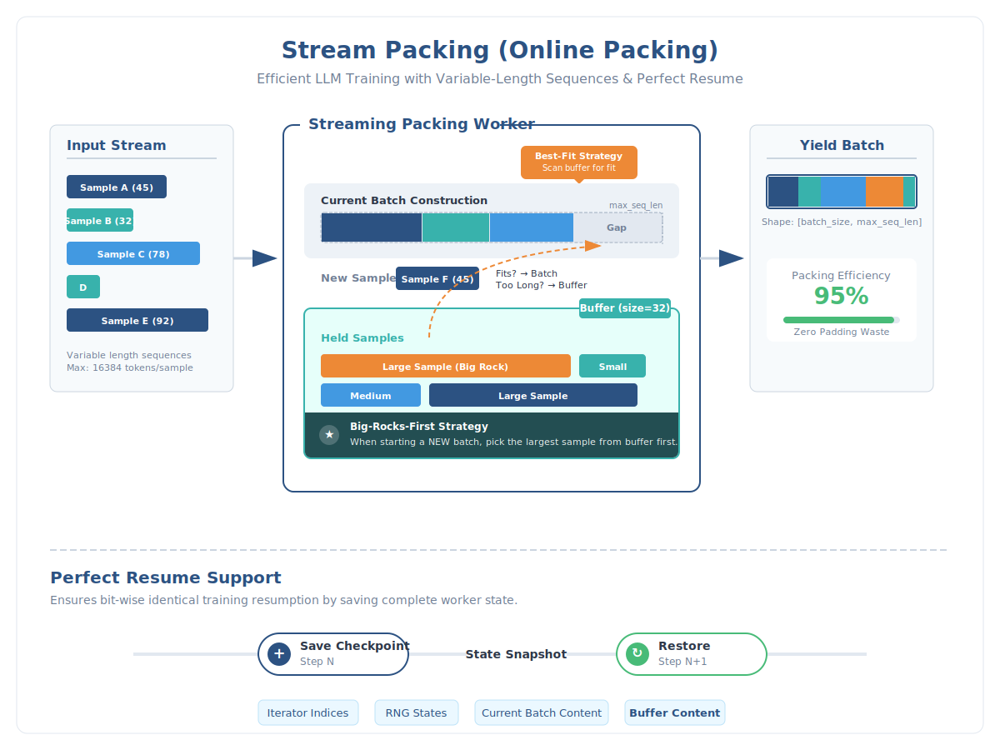

# Streaming Packing Technical Implementation

## Overview

Streaming Packing (also known as Online Packing) is an efficient data packing strategy for training large language models with variable-length sequences. This implementation features a high-efficiency buffer strategy with Best-Fit and Big-Rocks-First algorithms, along with perfect stateful resume support for bit-wise identical training resumption.

## Key Features

1. **Buffer Strategy**: Maintains a buffer to store samples that don't fit in the current batch
2. **Best-Fit Algorithm**: Fills remaining space in the current batch using the best-fitting samples from the buffer
3. **Big-Rocks-First Strategy**: When starting a new batch, picks the largest sample from the buffer first
4. **Perfect Resume**: State includes buffer content, ensuring bit-wise identical resume

## Architecture



### Core Components

#### 1. LazyJsonlLoader
- **Purpose**: Lazy loader for JSONL files with fast index-based access
- **Key Features**:
  - Builds an offset index for each line in JSONL files
  - Thread-safe file handle management
  - Supports multiple JSONL files
  - Memory-efficient: only loads data when accessed

**Implementation Details**:
```python
class LazyJsonlLoader:
    - _build_index(): Creates offset index for fast random access
    - __getitem__(idx): Retrieves sample by index using file offset
    - Thread-safe file handle caching per thread
```

#### 2. LazySupervisedDataset
- **Purpose**: Lazy-loading dataset with index-based access
- **Key Features**:
  - Supports repeat_time for dataset repetition
  - Handles multimodal data (images, videos)
  - Deterministic data augmentation
  - Sample retry mechanism (up to 10 retries)

**Key Methods**:
- `__getitem__(idx)`: Retrieves a sample with deterministic augmentation
- `get_sample_at_global_idx(global_idx, seed)`: Gets sample by global index for resume
- `get_targets_flag(input_ids)`: Generates training labels from input_ids
- `multi_modal_get_item(messages, raw_data_item)`: Processes multimodal samples

#### 3. DeterministicIterator
- **Purpose**: Deterministic dataset iterator for reproducible data access
- **Key Features**:
  - Epoch-based shuffling with deterministic seeds
  - Cached epoch indices for efficiency
  - Tracks global index for resume support

**State Management**:
- `state_dict()`: Returns iterator state (seed, global_idx)
- `from_state_dict()`: Restores iterator from saved state

#### 4. StreamPackedDataset
- **Purpose**: Online packing IterableDataset with buffer and perfect stateful resume
- **Core Algorithm**:

```
Main Loop:
1. Try to fill current_batch from buffer (Best-Fit Strategy)
   - Find the largest sample in buffer that fits in remaining space
   - If found, move from buffer to batch and continue

2. If buffer has space, fetch new sample
   - If new sample fits in remaining space: add to batch
   - If not: add to buffer

3. Yield Logic
   - When current_batch is ready or buffer is full:
     * Finalize and yield current batch
     * Start new batch with largest sample from buffer (Big-Rocks-First)
     * Save state snapshot
```

**Key Methods**:
- `_get_sample_length(sample)`: Returns token length of a sample
- `_merge_samples(batch, sample)`: Merges a sample into the current batch
- `_finalize_batch(batch)`: Finalizes batch with metadata (sub_sample_lengths, attention_mask)
- `__iter__()`: Main iteration loop with buffer strategy

#### 5. WorkerState
- **Purpose**: Complete state of a worker, including buffer state
- **State Components**:
  - `iterator_states`: List of iterator states for each dataset
  - `sample_rng_state`: Random number generator state for dataset selection
  - `samples_produced`: Total samples produced
  - `batches_produced`: Total batches produced
  - `current_batch_locations`: List of (dataset_idx, global_idx) for current batch
  - `buffer_locations`: List of (dataset_idx, global_idx) for buffer samples

#### 6. StateAwareDataLoader
- **Purpose**: Wrapper around DataLoader to capture state snapshots from worker processes
- **Functionality**:
  - Extracts state metadata from batches
  - Updates main process dataset state
  - Enables state synchronization between workers and main process

## Packing Strategy Details

### Best-Fit Algorithm
When the current batch has remaining space, the algorithm:
1. Scans the buffer for samples that fit in the remaining space
2. Selects the largest sample that fits (greedy best-fit)
3. Moves the selected sample from buffer to batch
4. Repeats until no more samples fit

**Benefits**:
- Maximizes batch utilization
- Reduces padding waste
- Improves packing efficiency

### Big-Rocks-First Strategy
When starting a new batch:
1. Sorts buffer by sample length (descending)
2. Picks the largest sample as the first sample in the new batch
3. Ensures large samples are processed early

**Benefits**:
- Prevents buffer overflow with large samples
- Improves overall packing efficiency
- Reduces memory pressure

### Buffer Management
- **Buffer Size**: Configurable via `buffer_size` parameter (default: 32)
- **Buffer Overflow Prevention**: When buffer is full, forces batch yield
- **State Persistence**: Buffer content is saved in checkpoint for perfect resume

## Perfect Resume Support

### State Saving
- **Trigger**: Automatically saved during checkpoint creation via `DataloaderStateCallback`
- **Location**: `checkpoint-{step}/dataloader_state_rank{rank}.pt`
- **Content**: Complete worker states including:
  - Iterator positions for all datasets
  - RNG states
  - Current batch samples
  - Buffer samples

### State Loading
- **Trigger**: During training resume from checkpoint
- **Process**:
  1. Load dataloader state from checkpoint
  2. Restore iterator states for all datasets
  3. Restore RNG states
  4. Rebuild current batch from saved locations
  5. Rebuild buffer from saved locations

### Deterministic Guarantees
- **Seed Management**: Each worker and dataset iterator has a deterministic seed
- **Epoch Shuffling**: Uses deterministic shuffle seeds per epoch
- **Sample Retrieval**: `get_sample_at_global_idx()` ensures identical sample retrieval

## Parameters Configuration

### Core Packing Parameters

#### `max_num_tokens_per_sample` (default: 16384)
- **Type**: `int`
- **Description**: Maximum number of tokens allowed per individual sample
- **Usage**: Samples exceeding this limit are skipped
- **Setting**: Via `data_args.max_num_tokens_per_sample`
- **Recommendation**: Set based on your longest expected sample

#### `max_num_tokens` (default: 36864)
- **Type**: `int`
- **Description**: Maximum number of tokens per batch
- **Usage**: Batch packing stops when this limit is reached
- **Setting**: Via `data_args.max_num_tokens` or defaults to `data_args.max_seq_length`
- **Recommendation**: Typically 2-3x `max_num_tokens_per_sample` for good packing efficiency

#### `buffer_size` (default: 32)
- **Type**: `int`
- **Description**: Maximum number of samples in the buffer
- **Usage**: Controls memory usage and packing efficiency
- **Setting**: Via `data_args.packing_buffer_size`
- **Recommendation**:
  - Small datasets: 16-32
  - Large datasets: 32-64
  - Memory-constrained: 16
  - High efficiency: 64-128

#### `base_seed` (default: 42)
- **Type**: `int`
- **Description**: Base random seed for deterministic data access
- **Usage**: Combined with worker_id and dataset_id for per-worker/dataset seeds
- **Setting**: Via `training_args.seed`
- **Recommendation**: Use a fixed seed for reproducibility

#### `log_freq` (default: 10000)
- **Type**: `int`
- **Description**: Frequency of logging packing statistics
- **Usage**: Logs every N batches
- **Setting**: Hardcoded in `StreamPackedDataset.__init__()`
- **Recommendation**: Adjust based on training speed (1000-10000)

### Dataset Parameters

#### `dataset_weight`
- **Type**: `List[float]`
- **Description**: Relative weights for sampling from different datasets
- **Usage**: Automatically calculated from `repeat_time * len(dataset)`
- **Setting**: Automatically computed in `build_stream_packed_dataset()`
- **Recommendation**: Adjust via `repeat_time` in dataset metadata

#### `repeat_time`
- **Type**: `float`
- **Description**: Dataset repetition factor
- **Usage**: 
  - `>= 1`: Repeat dataset N times
  - `< 1`: Downsample to N% of dataset
- **Setting**: Via dataset metadata JSON
- **Recommendation**: Use for dataset balancing

### Training Parameters

#### `sample_log_interval` (default: 100)
- **Type**: `int`
- **Description**: Frequency of logging sample statistics
- **Usage**: Logs every N training steps
- **Setting**: Via `data_args.sample_log_interval`
- **Recommendation**: 100-1000 depending on training speed

#### `dataloader_num_workers`
- **Type**: `int`
- **Description**: Number of DataLoader worker processes
- **Usage**: Each worker maintains its own buffer and state
- **Setting**: Via `training_args.dataloader_num_workers`
- **Recommendation**: 4-8 for most cases, adjust based on CPU cores

## Usage Example

### Basic Configuration

```python
# In your training configuration JSON or arguments
{
    "max_num_tokens_per_sample": 16384,
    "max_num_tokens": 36864,
    "packing_buffer_size": 32,
    "sample_log_interval": 100,
    "dataloader_num_workers": 4
}
```

### Dataset Metadata Example

```json
{
    "dataset1": {
        "annotation": "path/to/annotations.jsonl",
        "root": "path/to/data/root",
        "repeat_time": 1.0,
        "data_augment": true
    },
    "dataset2": {
        "annotation": "path/to/annotations2.jsonl",
        "root": "path/to/data/root2",
        "repeat_time": 2.0,
        "data_augment": false
    }
}
```

## Performance Considerations

### Packing Efficiency
- **Target**: 80-95% batch utilization
- **Factors**:
  - Buffer size (larger = better efficiency)
  - Sample length distribution
  - `max_num_tokens` vs `max_num_tokens_per_sample` ratio

### Memory Usage
- **Buffer Memory**: `buffer_size * average_sample_size`
- **Current Batch**: Up to `max_num_tokens` tokens
- **Total**: Typically 100-500 MB per worker

### Computational Overhead
- **Best-Fit Search**: O(buffer_size) per iteration
- **Buffer Sorting**: O(buffer_size * log(buffer_size)) per batch
- **Overall**: Negligible compared to model forward/backward pass

## Troubleshooting

### Low Packing Efficiency
- **Symptom**: Packing efficiency < 70%
- **Solutions**:
  - Increase `buffer_size`
  - Adjust `max_num_tokens` / `max_num_tokens_per_sample` ratio
  - Check sample length distribution

### Memory Issues
- **Symptom**: OOM errors during training
- **Solutions**:
  - Decrease `buffer_size`
  - Decrease `max_num_tokens`
  - Reduce `dataloader_num_workers`

### Resume Issues
- **Symptom**: Training doesn't resume correctly
- **Solutions**:
  - Ensure `dataloader_state_rank{rank}.pt` exists in checkpoint
  - Check that `ignore_data_skip=True` is set
  - Verify dataset metadata hasn't changed

## Implementation Notes

### Multi-Worker Support
- Each worker maintains independent state
- State is saved per rank: `dataloader_state_rank{rank}.pt`
- Workers don't share buffer (distributed training)

### Deterministic Guarantees
- Same seed + same checkpoint = identical data order
- Global index tracking ensures reproducible sample access
- RNG states are fully preserved in checkpoints

## Code References

Key implementation files:
- `StreamPackedDataset.__iter__()`: Main packing loop (lines 574-781)
- `WorkerState`: State management (lines 412-453)
- `DeterministicIterator`: Deterministic iteration (lines 357-409)
- `DataloaderStateCallback`: Checkpoint saving (lines 858-912)

